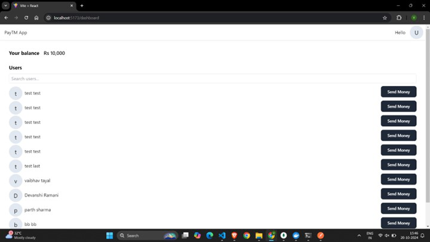
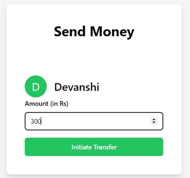
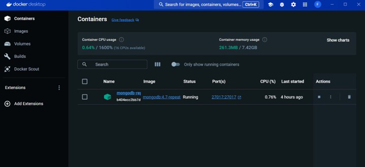
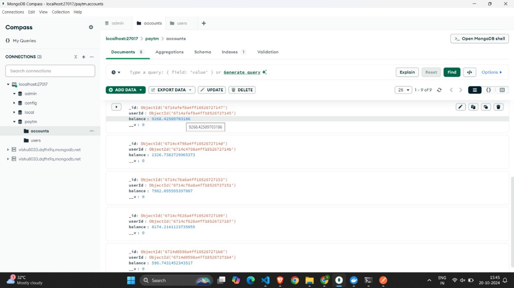
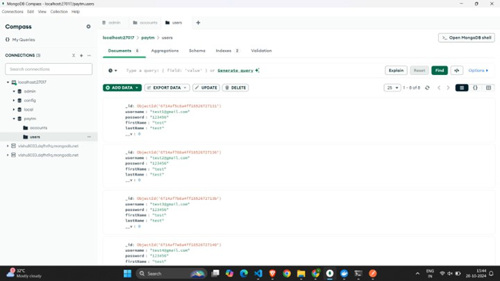
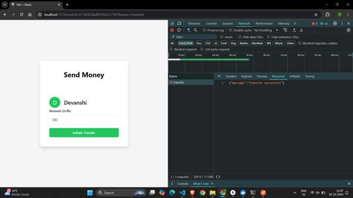

# PaymentHub 
**PaymentHub** is a secure, scalable digital payment gateway built with modern web technologies including Node.js, Express.js, MongoDB, React, and Tailwind CSS. It enables real-time money transfers, user authentication, and a responsive interface for smooth financial management.

## Technologies Used

- **Frontend**: React, Tailwind CSS
- **Backend**: Node.js, Express.js
- **Database**: MongoDB, Mongoose
- **Authentication**: JWT (JSON Web Tokens)
- **Containerization**: Docker
- **Dev Tools**: MongoDB Compass, Visual Studio Code

## Key Features

- User Signup and Login
- JWT-based Authentication and Authorization
- Real-time Money Transfer Functionality
- Search Users by Name
- Responsive Dashboard UI
- Data Validation using Zod
- Modular Code with Reusable Components

## Frontend
<h3>Sign Up Page</h3>

<h3>Sign In Page</h3>

<h3>Dashboard</h3>

<h3>Money Transfer (Frontend)</h3>

## Backend

<h3> Docker Setup</h3>

<h3> MongoDB View</h3>

<h3>Money Transfer (Backend)</h3>

